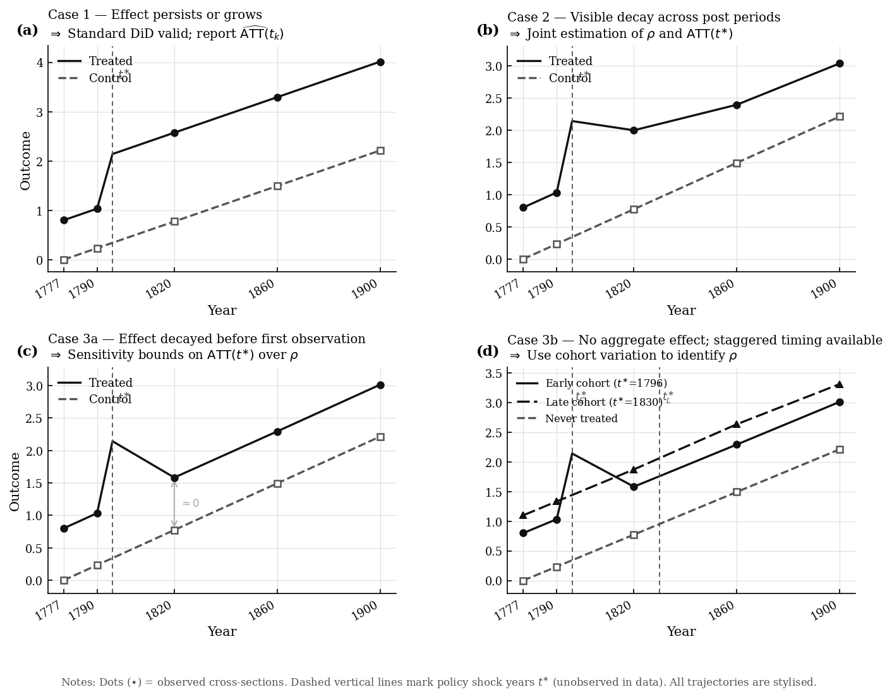

# timing-mismatch

A Python toolkit for diagnosing temporal misalignment in historical difference-in-differences research — when a policy shock at $t^{\ast}$ falls between the available cross-sections.

[](https://github.com/Chin933/temporal-did/actions/workflows/tests.yml)



## The Problem

Historical records rarely coincide with the exact year of a policy shock. You may have prefectural gazetteers from 1777, 1820, 1888, and 1911, but the reform you study happened in 1796. The standard approach — using the nearest post-shock cross-section as the "post" period — estimates the treatment effect at $t_2$, not at $t^{\ast}$:

$$\text{DiD}(t_1, t_2) = \widehat{\text{ATT}}(t_2) \neq \text{ATT}(t^{\ast})$$

How large the bias is depends on two things: **how far** $t^{\ast}$ is from the nearest cross-section, and **how fast** the treatment effect decays after the shock.

## Case Classification

The toolkit automatically classifies your setting based on what the post-shock DiDs reveal.

| Case | Pattern in post-shock DiDs | Identification strategy |
|------|---------------------------|------------------------|
| **1** | Significant and stable/growing | Dynamic ATT$(t_k)$ at each cross-section; standard DiD valid |
| **2** | Significant but declining | Jointly estimate decay rate $\rho$ and ATT$(t^{\ast})$ via log-linear regression across post periods (or staggered cohorts) |
| **3a** | All $\approx 0$, no staggered timing | Effect decayed before first observation; sensitivity bounds over $\rho$ |
| **3b** | All $\approx 0$, staggered timing available | Use cohort timing variation to attempt identification |

## Installation

```bash
git clone https://github.com/Chin933/temporal-did.git
cd temporal-did
pip install -e .
```

## Quick Start

```python
from timing_mismatch import diagnose, plot_temporal_mismatch, plot_case_diagram

# df: panel with columns [county_id, year, outcome, treatment]
result = diagnose(
    data=df,
    outcome="grain_tax",
    treatment="reform",
    shock_year=1796,           # t*: reform year (not in data)
    pre_years=[1777],          # all pre-shock cross-sections
    post_years=[1820, 1888, 1911],   # all post-shock cross-sections
    unit_id="county_id",
)

print(result.summary())
# Temporal Mismatch Diagnostics
#   Shock year   : t* = 1796
#   Pre periods  : [1777]
#   Post periods : [1820, 1888, 1911]
#   Case         : 2  —  Effect decays but visible; jointly estimate rho and ATT(t*)
#   ...

fig = plot_temporal_mismatch(result)
fig.savefig("diagnostics.png", dpi=150, bbox_inches="tight")
```

### With staggered treatment timing

If different units were treated in different years, pass a column with each unit's shock year:

```python
result = diagnose(
    data=df,
    outcome="grain_tax",
    treatment="reform",
    shock_year=1796,
    pre_years=[1777],
    post_years=[1820, 1888, 1911],
    unit_id="county_id",
    shock_year_col="reform_year",   # NaN for never-treated units
)
```

## Case-Specific Outputs

### Case 1 — Effect persists or grows
Reports dynamic ATT$(t_k)$ for each post-shock cross-section.

### Case 2 — Effect decays, still visible
Jointly estimates decay rate $\rho$ and ATT$(t^{\ast})$ by log-linearising the AR(1) model:

$$\log|\text{DiD}(t_1, t_k)| = \log|\text{ATT}(t^{\ast})| + (t_k - t^{\ast})\log\rho$$

Fitted by WLS across post-periods (or cohort $\times$ calendar-time cells for staggered data).

### Case 3a — Effect decayed before first post period
Returns an **identified set**: for each assumed $\rho$, the implied ATT$(t^{\ast})$ and its 95% CI. A fast-decay assumption $(\rho \ll 1)$ widens the interval toward $+\infty$ — the data cannot identify ATT$(t^{\ast})$ without additional assumptions.

### Case 3b — All post DiDs $\approx 0$, staggered timing available
Routes to the Case 2 staggered estimator using cohort variation. The identified set is also reported as a fallback.

## Visualising the Four Cases

```python
from timing_mismatch import plot_case_diagram

fig = plot_case_diagram()   # conceptual parallel-trends diagram
fig.savefig("cases.png", dpi=150, bbox_inches="tight")
```

## Monte Carlo Validation

```python
from timing_mismatch.monte_carlo import run_monte_carlo
from timing_mismatch.plot import plot_monte_carlo

mc = run_monte_carlo(
    n_simulations=500,
    shock_year=1800,
    pre_year=1796,
    post_year=1820,
    true_att=1.0,
    dynamics="decaying",
    decay_rate=0.95,
    adjustment_rho=0.95,
)
print(mc.attrs["summary"])
fig = plot_monte_carlo(mc)
```

## Theoretical Background

See [THEORY.md](THEORY.md) for derivations of the bias formula, case identification conditions, and the log-linear joint estimator.

## Citation

```bibtex
@misc{zhou2026timing,
  title  = {Timing Mismatch in Historical Difference-in-Differences},
  author = {Zhou, Qinnan},
  year   = {2026},
  url    = {https://github.com/Chin933/temporal-did}
}
```

## License

MIT
